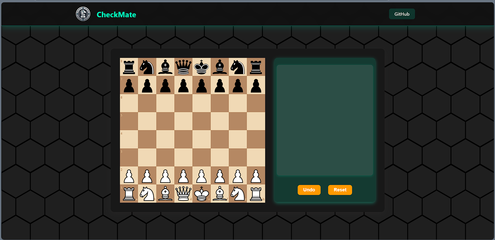

# CHECKMATE
<hr>

<div align="center">
     
    <p><b>Chess Bot using Transformer Model</b></p>
</div>

<hr>

## Backend: 
<div align="center">
    
</div>

<hr>

## Frontend: 
<div align="center">
    
</div>

<hr>

## Libraries Used:
<div align="center">
     
    
</div>

<hr>

## About:
`Checkmate` is an AI-powered chess application designed to provide intelligent gameplay experiences. 
It uses a Transformer model for move prediction and a React-based UI for an interactive chessboard display. 
The project demonstrates the synergy of cutting-edge AI with user-friendly interfaces.

<hr>

## File Structure:
```plaintext
checkmate/
│
├── py/                        # Backend Python project
│   ├── model/                 # Trained Transformer models and checkpoints
│   ├── dataset/               # Dataset used in training the model
│   ├── vocab/                 # Contains unique chess moves
│   ├── chessutils/            # Chess-specific utility scripts
│   ├── play.py                # Flask server for the backend
│   ├── requirements.txt       # Python dependencies
│   └── ...                    # Other backend scripts
│
├── ui/                        # Frontend React project
│   ├── src/                   # React source files
│   ├── public/                # Static assets for the React app
│   ├── package.json           # Node.js dependencies
│   └── ...                    # Other frontend files
│
├── readme/                    # README-related images
│
├── .gitignore                 # Git ignore rules
├── README.md                  # Project documentation
└── ...
```

<hr>

## Create your own Model
- download the dataset from Kaggle: https://www.kaggle.com/milesh1/35-million-chess-games
- rename the file to `original_data.txt` and put it in `data.
- run `process_data.py` to create a vocabulary file automatically.
- run `train.py` to train the model and put the output model in model folder.

<hr>

## Use Application:
1. Clone this repository:
    ```bash
    git clone https://github.com/Titanium-SS/checkmate.git
    ```
2. Navigate to the backend folder and set up Python dependencies:
    ```bash
    cd py
    pip install -r requirements.txt
    ```
3. Start the backend server:
    ```bash
    python app.py
    ```
4. Navigate to the frontend folder and set up the React application:
    ```bash
    cd ui
    npm install
    npm start
    ```
5. Open your browser and go to `http://localhost:3000` to start playing.

<hr>

## Gameplay:
<div align="center">
     
    
</div>

<hr>

## Features:
- AI-powered move prediction using a Transformer model.
- Interactive chessboard with responsive design.
- Seamless integration of backend and frontend for smooth gameplay.

<hr>

## Future Enhancements:
- Real-time multiplayer functionality.
- Deployment on cloud platforms for remote access.
- Improved AI model with more extensive training.
- Ability to play both as Black and as White
<hr>
